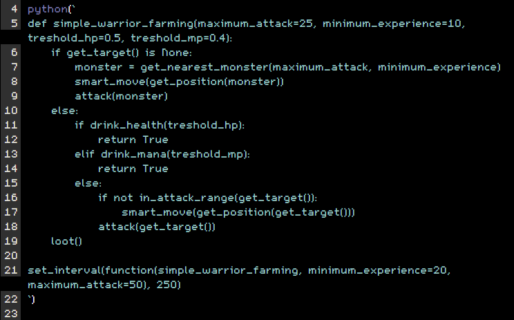

# AdventureLanThon [WIP]
Adventure Land :: Browser Python Scripting Support

paste the run.js content in the CODE editor

example of __simple__ *warrior* farming and looting afterwards



```javascript
var _code=null;function python(code,interval=-1){_code=code;var load_script=function(d,s,id,code,src){var js,fjs=d.getElementsByTagName(s)[0];if(null==src){var request=new XMLHttpRequest;return request.open("GET","//cdn.jsdelivr.net/gh/R0bertus/AdventureLanThon@1144c1721da6159c45508fdb78181d615e6d9024/alt/core.py",!1),request.onreadystatechange=function(){4===request.readyState&&(200===request.status||0==request.status)&&(ALT_core=request.responseText,_code=__BRYTHON__.python_to_js(ALT_core+_code),-1==interval?eval(_code):setInterval(function(){eval(_code)},1e3*interval))},void request.send(null)}return d.getElementById(id)?void("brython-sdk"==id?load_script(document,"script","brython-stdlib",code,"//cdn.jsdelivr.net/gh/R0bertus/AdventureLanThon@749ac07f2fa6b376cb85f056d3abb39869d729a8/brython/brython_stdlib.js"):"brython-stdlib"==id&&load_script(document,"script",null,code,null)):void(js=d.createElement(s),js.id=id,js.onload=function(){"brython-sdk"==id?load_script(document,"script","brython-stdlib",code,"//cdn.jsdelivr.net/gh/R0bertus/AdventureLanThon@749ac07f2fa6b376cb85f056d3abb39869d729a8/brython/brython_stdlib.js"):"brython-stdlib"==id&&load_script(document,"script",null,code,null)},js.src=src,fjs.parentNode.insertBefore(js,fjs))};load_script(document,"script","brython-sdk",code,"//cdn.jsdelivr.net/gh/R0bertus/AdventureLanThon@749ac07f2fa6b376cb85f056d3abb39869d729a8/brython/brython.min.js")}

# javascript version by Spadar
# https://github.com/Spadar/AdventureLand/blob/55a916ed389630702ae143247b9c919c23785c13/GUI/GoldMeter.js
enable_goldmeter() 

python(`
def simple_warrior_farming(maximum_attack=25, minimum_experience=10, treshold_hp=0.5, treshold_mp=0.4):
    if get_target() is None:
        monster = get_nearest_monster(maximum_attack, minimum_experience)
        smart_move(get_position(monster))
        attack(monster)
    else:
        if drink_health(treshold_hp):
            return True
        elif drink_mana(treshold_mp):
            return True
        else:
            if not in_attack_range(get_target()):
                smart_move(get_position(get_target()))
            attack(get_target())
    loot()

set_interval(function(simple_warrior_farming, minimum_experience=20, maximum_attack=50), 250)
`)
```
